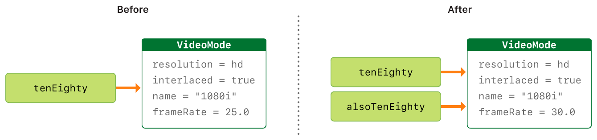

# Swift Code Lab


## Playing with some swift concepts

> XCode does not support running console programs with alternative file names from the usual main.swift

> Therefore to run this code you will need to use the terminal

```
$ cd swift-basics/swift-basics
$ swift <file-name>.swift

//e.g
swift main.swift 
// this will run the main.swift file
```

## Swift Basics
Swift is a language for **iOS, macOS, watchOS and tvOS** development. Swift shares certain similarities with **C** and **Objective-C**

Swift provides it's own versions of the C value types such as **Int for integers, double and float for floating type values, Bool for booleans and String for textual data**. Swift also provides three primary **collection types**, **Array**, **Set** and **Dictionary**.

Constants are used in Swift to incrase code safety and declare intent when working with values that should not change.

Swift introduces advanced values that are not found in C or Objective-C such as **tuples**. *Tuples are used to pass around groupings of values.* You can use tuples to return multiple values from a function as a single **compund value*.

Swift also introduces the use of Optional types which handle absence of values.

Swift is type safe, which means you can catch errors early in your code.

### Constants and Variables
Constants and variables associate a name with a value such *welcomeMsg = "Hello Joseph" or numberOfUsers = 1000*
The value of a constant cannot be changed once it is set while a variable to be changed.


## Swift Reference Types(Classes) Vs Value Types(Structures and Enumerations)

> Classes are references types while atructures and enumerations are value types.A value type is a type whose value is copied when it's assigned to a variable or constant. Classes are reference types. Unlike value types, reference types are not copied when they are assigned to a variable or constant, or when they are passed to a function. Rather than a copy a referebce to the same existing instance is used.ref

### 1. Value Types


### 2. Reference Types


