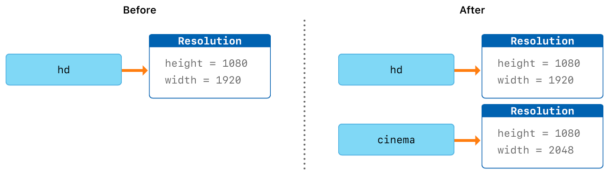

# Swift Code Lab


## Playing with some swift concepts

> XCode does not support running console programs with alternative file names from the usual main.swift

> Therefore to run this code you will need to use the terminal

```shell
$ cd swift-basics/swift-basics
$ swift <file-name>.swift

//e.g
swift main.swift 
// this will run the main.swift file
```

# Swift Basics
Swift is a language for **iOS, macOS, watchOS and tvOS** development. Swift shares certain similarities with **C** and **Objective-C**

Swift provides it's own versions of the C value types such as **Int for integers, double and float for floating type values, Bool for booleans and String for textual data**. Swift also provides three primary **collection types**, **Array**, **Set** and **Dictionary**.

Constants are used in Swift to incrase code safety and declare intent when working with values that should not change.

Swift introduces advanced values that are not found in C or Objective-C such as **tuples**. *Tuples are used to pass around groupings of values.* You can use tuples to return multiple values from a function as a single **compund value*.

Swift also introduces the use of Optional types which handle absence of values.

Swift is type safe, which means you can catch errors early in your code.

### Constants and Variables
Constants and variables associate a name with a value such *welcomeMsg = "Hello Joseph" or numberOfUsers = 1000*
The value of a constant cannot be changed once it is set while a variable can be changed.

Constants and variables must be delcared before they can be used. 
Constants are declared with the **let** keyword while variables are declared with the **var** keyword

```swift
let firstManInSpace: String = "Yuri Gagarin from Russia 1961"
var nextMarsMission: String = "Unlikely"
```

### Type Annotations
Provide *type annotation* to specify what type the variable or constant can store. Type annotation is specified by placing a color **:** after the variable or constant name followed by the type.

```swift
let moonLandingYear: Int = 1969
var totalApolloMissions: Int = 14
```

### Printing Constants and Variables
You can print a var or let with the print function:
```swift
print(_:seperator:terminator)
```
The print() is a global function that prints or more values to an appropriate output.

Swift uses **String interpolation** to include the name of a constant or a variable as a placeholder in a longer string, this prompts Swift to replace it with the appropriate value.

```swift
let currentDay: String = "Sunday"
print("Today is \(currentDay)")
```

You can extend String delimiters to create strings containing characters that would otherwise be consider string interpolation.

```swift
let planet: String = "Earth"
print(#"Planet \(planet) supports life"#) //Planet \(planet supports life)
print("Planet \(planet) supports life") //Planet Earth supports life
print(#"Planet \#(planet) supports life"#) //Planet Earth supports life
```

### Comments
Use comments to include non-executable text in your code.

**Single line comments**
```swift
//This is a single line comment
```

**Multi-line comments**
```swift
/**
 * This is a
 * multi-line comment
 **/
```

### Semicolons
Swift does not require you to use semicolor **;** however you must add a semicolon to have multiple statements in one line of code

```swift
let moode: String = "🥵"; print(\(moode))
```

### Integers
Integers are whole numbers with no fractional components, 32 or -32.

### Floating Point Numbers
Floating points numbers are numbers with fractional component, such as **3.1423212** or **-2.134243**
Floating point number can represent a much larger range of number than Int can and can also store much larger numbers.
Swift provides two signed floating point number types: **Double** and **Float**.

* **Double** represents a *64 bit* floating point number
* **Float** represents a *32 bit* floating point number

Double has a precision of about 15 decimal points while Float has about 6 decimal points.

```swift
let moonOscillationRadiusFloat: Float = 0.123456789101112131415161718192021222324252627282930123456789101112131415161718192021222324252627282930

print("Moon Oscillation Radius in Float \(moonOscillationRadiusFloat)") //this is striped down to 0.12345679 since Float is limited to 32-bit and about 6 decimal points precision

let moonOscillationRadiusDouble: Double = 0.123456789101112131415161718192021222324252627282930123456789101112131415161718192021222324252627282930

print("Moon Oscillation Radius in Double \(moonOscillationRadiusDouble)") //this is represented as 0.12345678910111213 which is longer than the matching float value
```

Numeric literals can contain extra formatting to make them easier to read.

```swift
let cashBalance: Double = 345_342_001
```

### Type Aliases
Type alias provide an alternative name for an existing type
You define type alias with the **typealias** keyword

```swift
typealias StringText = String
var astronaut: StringText = "Buzz Aldrin"
```

### Tuples
Tuples grouing multiple values into a single compound value. The values within a tuple can be of different types.

```swift
let radioTelescopeWavelength = ("Radio 🔭", "mm", 1)
let infraredTelescopeWavelenth = ("infrared 🔭", "nm", 700)
```

You can decompose a tuples contents into seperate constants and variables

```swift
let (name, units, value) = radioTelescopeWavelength

print("Name: \(name) Wavelength: \(value) in \(units)")
```

If you only need part of the tuple, you can ignore some parts of the tuple with an underscore **(_)**

```swift
let (name, _, value) = radioTelescopeWavelength
print("Name: \(name) Wavelength: \(value) in whatever units")
```

Alternatively access the tuple values using their indices starting with 0

```swift
let infraredTelescopeWavelenth = ("infrared 🔭", "nm", 700)
print("Name: \(infraredTelescopeWavelenth.0) Wavelength: \(infraredTelescopeWavelenth.2) in \(infraredTelescopeWavelenth.1)")
```
You can name tuple elements at declaration

```swift
let radioTelescope = (name: "Radio Telescope", units: "mm", value: 1)
print("\(radioTelescope.name) \(radioTelescope.value) \(radioTelescope.units)")
```

### Optionals
Optionals are used in situations where a value might be absent. 
Optionals represent two states, either absence of a value of presence of a value.

```swift
var apolloMission: Int? = nil
``` 

### Optional Binding
You use optional binding to determine whether an optional contains a value and if so to make that value available as a temporary variable or value.

```swift
var apolloMission: Int? = nil
if let mission = apolloMission {
    print("Found a matching apollo mission \(mission)")
} else {
    print("We could not find an apollo mission")
}
```

### Error Handling

Use error handling to respond to error conditions your app might experience during execution.
Error handling allows you to determine the underlying cause of the failure and to propagate the error to another part of the program if need be.

When a function encounters an error condition it **throws** an error.

```swift
func doSomeDangerousThings() throws {
    
}
```

When you call a function that can throw an error you prepend it with the **try** keyword.

```swift
do {
    try doSomeDangerousThings()
} catch {
    print("Whoops! doing dangerous things leads to some failures")
}
```

- - -

# Basic Operators

Operators are special symbols or phrases that are use to check, changed or combine values.

```swift
let sum = 2 + 2
```

### Overflow Operators

If you try to insert a number into an integer constant or variable that can't hold that value, by default swift reports it as an error instead of allowing an invalid value to be created.
This behaviour increases safety while working with values/numbers that are either too large or too small.

For example the swift type UInt16 allowes a signed integer between -32768 and 32767.
Trying to set a number outside this range results in an error:

```swift
var maximumUInt16 = UInt16.max

//maximumUInt16 now hold 32767 which is the maximum number a UInt16 can hold.

maximumUInt16 += 1 // causes an error

```

Arithmetic operators (+,-,*,/,%) detect and dissallow value **overflow**, to avoid unexpected results while working with numbers that become larger or smaller than the allowed value range of the type that stores them.

You can opt into value overflow by using Swift's overflow operators.

### Operator Terminology

* **Unary Operators**
Unary operators operate on one target such as -a.

```swift
let a: Int = 1
-a
!a
```

* **Binary Operators**
Binary operators operate on two targets such as 2 + 2

* **Ternary Operators**
Ternalry operators operate on three targets. Like **C** Swift has only one ternary operator, the **ternary conditional operator**

```swift
let a: Int = 1
let b: Int = 2

let max: Int = a > b ? a : b
```

### Assignment Operator
The assignment operator a = b initializes a with the value of b

```swift
let yearOfBirth: Int = 1900
let currentYear: Int = 2025
let age: Int = yearOfBirth - currentYear

print("Age is \(age)")
```

### Remainder Operator
The operator **(a % b)** works out how many multiples of b will fit inside a and returns the value left out.

> To Calculate 9 % 4, you workout how many 4s fit in 9
> You can fit two 4s inside nine and the remainder is 1


```swift
let remainder = 15 % 2
```

> However, % is unavailable for floating point numbers

### Compound Assignment Operator
Swift provides compound assignment operators that combine assignment **(=)** with an operatrion such as **(-)**. e.g **+=**,**-=**,***=**.

```swift
let j = 5
let tenMultiplesOfJ *= 10
let fiveStepsForward += 5
let less3 -= 3
```

### Comparison Operators
 
 Swift supports the following comparisons:

| Operation     | Comparison Operator   |
| --------------|-----------------------|
| Equal to      | ==  ,  a == b         | 
| Not Equal to  | !=  ,  a!=b           |
| Greater than  |  >  ,  a>b            |
| Less than     |  <  ,  a<b            |
| Greater than or equal to | >= , a >= b|
| Less than or equal to | <= , a <= b   |
| Identical to  |  === , objA === objB  |
| Not Identical to  |  !== , objA !== objB  |
|               |                       |


### Ternary Conditional Operator
Ternary conditional operator is a special operator with three parts:

**question ? answer1 : answer2**

If question is true, it evaluates answer1 and returns it's value, while if answer is false it evaluates answer2 and returns it's value.

This is shorthand for:

```swift
if question {
    answer1
} else {
    answer2
}
```

```swift
let result = question ? answer1 : answer2
```

### Nil-Coalescing Operator | ??

The **nil coalescing operator** **a ?? b**, unwraps an *optional* a if it contains a value, or *returns a default value* b if a is nil. 

**b** must match the type of the value stored in **a**

The coalescing operator is shorthand for:

```swift
let a: Int? = nil
let b: Int = 0

let value = a != nil ? a! : b
```

```swift
let a: Int? = nil
let b: Int = 0

let value = a ?? b
```

### Range Operators

Types of Range Operators

1. **Closed Range Operator**
2. **Half-Open Range Operator**
3. **One Sided Ranges**

**Closed Range Operator** - Closed range operator **(a...b)** defines a range of value between **a** and **b** and includes the values of a and b. <u>*a must be greater than b**</u>.

```swift
for dayOfWeek in 1...7 {
    print("It's now the \(dayOfWeek)th day of the week")
}
```

**Half Open Range** - Half range operaror **(a..<b)** defines a range that runs from a to b but does not include b. The half range operator contains it's first value **a** but not it's second value **b**.

```swift
for monthIndex in 0..<12 {
    print("Month index is \(monthIndex), actual month is \(monthIndex + 1)")
}
```
**One-Sided Range** - One sided range operator **([...b], [a...], [...<5])** contains ranges that **continue as far as possible in one direction**.

```swift
let countDowns: [Int] = [0,1,2,3,4,5] 

for bombCountDown in countDowns[...5] {
    print("Tick \(bombCountDown) \(bombCountDown == 5 ? "Cut Red...Boom 💣" : "...")")
}

for bombCountDown in countDowns[..<5] {
    print("Tick \(bombCountDown) \(bombCountDown == 4 ? "Cut Green...💣" : "...")")
}

for bombCountDown in countDowns[1...] {
    print("Tick \(bombCountDown) \(bombCountDown == 4 ? "Cut Red...Boom 💣" : "...")")
}
```

### Logical Operators

Logical operators modify and combine Boolean logic values.
Swift Supports;

* Logical AND - **&&**
* Logical OR - **||**
* Logical NOT - **!**

- - -

# Strings and Characters

A string is a series of characters such "Hello World".
String concatenation is accompilished by combining two strings with the + operator. 
String is **mutable** unless explicitly declared as  a **let** constant.

```swift
let language: String = "Shwifty" //immutable
var bestLanguageNow: String = "Shwifty" //mutable
```

### String literals

String literals are *predefined* strings.

```swift
let literally: String = "Literaly now.."
```

### Multiline String literals

A multiline String literal comprises of a series of characters **sorrounded the three double quotation marks**.

```swift
let messageFromCEO: String = 
    """
        Ladies and men, I bring you
        a seires of ridiculous 
        cooperate bs

        from our main HQ

        Yours cheerful,
        The CEO
    """
```

### Special Characters in String literals

Special characters can inlcude:

* **"\0"** - null character
* \\\ - backslash
* \t - horizontal tab
* \r - carriage return

### Extended String Delimiters

You can pleace extended string delimiters to include special characters within a string without invoking the special characters' effect.

Sorround the string with number sign **#**. 

```swift
let shakeSpear = #"Be not afraid of greatness\nWe know what we are, but know not what we may be"#

//prints : Be not afraid of greatness\nWe know what we are, but know not what we may be
```
### Initializing an empty string

To create an empty string either initialize a string with empty string literal or create a new String instance

```swift
var emptyString: String = ""
var anotherEmptyString: String = String()
```

### String Mutability

String is immutable if it is assigned to a **let** constant or otherwise mutable if assigned to a **var** variable.

```swift
let immutableString: String = "This is permanence"
var mutableString: String = "Nothing is permanent, even this will change"

print("immutableString \(immutableString) :mutableString \(mutableString) ")
```

### Extended Grapheme Clusters

An extended grapheme cluster is a sequance of one or more unicode scalars that when combined produce a single human readable character.

```swift
let eAcute: Character = "\u{e9}"
```

### Counting Characters

Use the String **count** property to retrieve the number of characters in a String

```swift
let alphabet: String = "ABCDEFGHIJKLMNOPQRSTUVWXYZ"
let numberOfCharactersInAlphabet: Int = alphabet.count

print("Number of characters in alphabet \(numberOfCharactersInAlphabet)")
```

### Accessing and Modifying a String

Modify a String by using it's **methods and properties** or by using the **subscript syntax**.

Swit Strings can't be indexed by integer value because each character in the String holds different memory size.

Use the **startIndex** to access the first character in the String and **endIndex** to access the last character in the String.

> The **endIndex** is the position after the last character in the String, therefore the **endIndex is not a valid argument to the String's subscript** and will result in a ***Fatal error*: String index is out of bounds**

```swift
let title: String = "The Batman"
let startChar: Character = title[title.startIndex]
//let lastChar: Character = title[title.endIndex] error index out of bounds

print("Start char: \(startChar), End Char: \(lastChar)")
```

> If the String is empty, the start and end index are the same.

```swift
let emptyWords = ""
let start: Character = emptyWords[emptyWords.startIndex]
let end: Character = emptyWords[emptyWords.endIndex]
```

You can access the indices before and after a particular index using the **index(before:)** and **index(after:)** methods of a String.

```swift
let easy: String = "ABC"
var mid: Character = easy.index(before: easy.endIndex)

print("mid ABC is ==> \(easy[mid])")

mid = easy.index(after: easy.startIndex)

print("mid is still ==> \(easy[mid])")
```

To access an index further away from the current index, you can use: **index(currentIndex: offsetBy:)** method.

```swift
let joy: String = "happy😁";
let emoji: Character = joy[joy.index(joy.startIndex, offsetBy:5)]

print("Joy emoji is ==> \(emoji)")
```

## Inserting and removing from a String

* **Insert a single character**

To insert a single character at a specified index of the String use **insert(character, at: index)**

```swift
var why = "why"
why.insert("?", at: why.endIndex) // why ?
```

* **Insert contents of another String**

To insert the contents of another String use the **insert(contentsOf, at)**

```swift
var warn = "You have been warned "
var details = " do not enter, private property"
warn.insert(contentsOf: details, at: warn.index(before: warn.endIndex))
// You have been warned do not enter, private property
```

* **Remove a single character from String**

Use the **remove(at: Index)** to remove a single character from String

```swift
var hello = "Hello!"
hello.remove(at: hello.index(before: hello.endIndex))
```

* **Remove a range of characters(Substring) from a String**

To remove a substring from a specified range, use the **removeSubrange(range)**

```swift
var helloWorld = "hello world"

let range = hello.index(helloWorld.endIndex, offsetBy: -5)..<helloWorld.endIndex

helloWorld.removeSubrange(range)

// hello
```

# String and Characters Equality

You can check equality of strings and characters using the operator **==** and not equal operatior **!=**

```swift
var englishGreeting = "hello"
var spanishGreeting = "hola"

if englishGreeting == spanishGreeting {
    print("English is same as spanish")
}
```
**hasPrefix** and **hasSuffix**

Check whether a String has a particular string prefix or suffix.

```swift
var greeting = "Hi mary"

if gretting.hasPrefix("Hi"){
    print(greeting)
}

var ending = "This is the end"

if ending.hasSuffix("end"){
    print(ending)
}
```

- - - 
## Swift Reference Types(Classes) Vs Value Types(Structures and Enumerations)

> Classes are references types while atructures and enumerations are value types.A value type is a type whose value is copied when it's assigned to a variable or constant. Classes are reference types. Unlike value types, reference types are not copied when they are assigned to a variable or constant, or when they are passed to a function. Rather than a copy a referebce to the same existing instance is used.ref

### 1. Value Types



### 2. Reference Types


